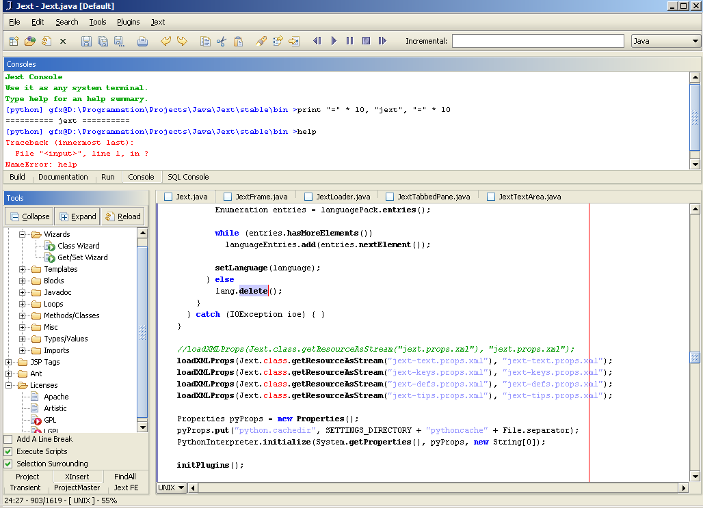

# Jext

Jext is a source code editor for Windows, Linux and macOS that I started writing in 1998 and maintained until 2004 on [SourceForge](https://sourceforge.net/projects/jext/) (before GitHub was a thing).

Jext was originally created to support the Java programming language but ended up doing much more with support for many other languages, light IDE features and extensibiliy via plugins or scripts (Python and a custom RPN-style language called Dawn).

The last published version was Jext 5.0 and this repository is a source snapshot of the last version I ever published (see Disclaimer section below).

## Contributors

Jext was made possible thanks to the contributions and support of many talented people including:

- Slava Pestov and Mike Dillon
- Karsten Lentzsch
- Aaron Miller
- Matthew Allbrecht
- Paolo Giarrusso
- Scott Bellamy
- Matthew Benson
- Julien Ponge
- Bogdan Mitu
- Cyrille Legrand and Benoit Rigaud
- Scott Wyatt and Barranger Ridler
- Michel Ludwig
- Steve Lawson
- Ian D. Stewart
- Grant Stead

## Source code

The interesting bits are in the following places:

- [jext](./lib/org/jext): Jext itself
- [plugins](./plugins): a few plugins that shipped with Jext
- [jedit](./lib/org/gjt/sp/jedit): syntax highlighting text area from jEdit
- [dawn](./dawn): Jext's custom RPN scripting language examples

## License

Jext is licensed under [GPL-2](./LICENSE).

Some icons are licensed under [CPL-1.0](https://opensource.org/licenses/cpl1.0.php).

## Disclaimer

This code base:

- Is incomplete: all source bits that do not fall directly under GPL-2 were removed
  (public domain, other permissive/Open Source licenses). Some prebuilt binaries from
  other personal projects have been removed as well.
- Will not compile: see previous item.
- Is not maintained.
- Is available for educational/sentimental purposes only.
